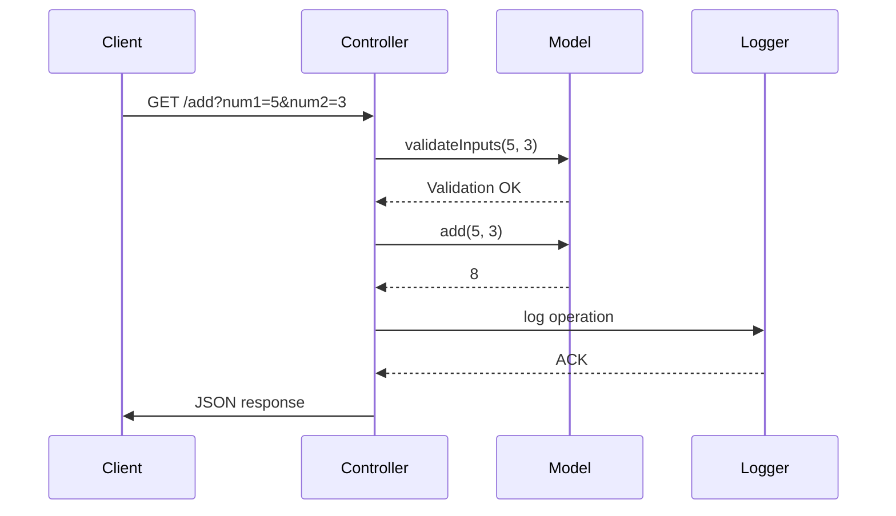

```mermaid
sequenceDiagram
    participant Client
    participant Controller
    participant Model
    participant Logger

    Client->>Controller: GET /add?num1=5&num2=3
    Controller->>Model: validateInputs(5, 3)
    Model-->>Controller: Validation OK
    Controller->>Model: add(5, 3)
    Model-->>Controller: 8
    Controller->>Logger: log operation
    Logger-->>Controller: ACK
    Controller->>Client: JSON response
```
